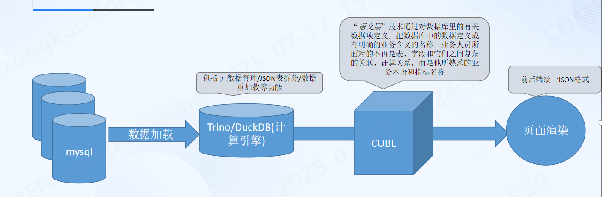
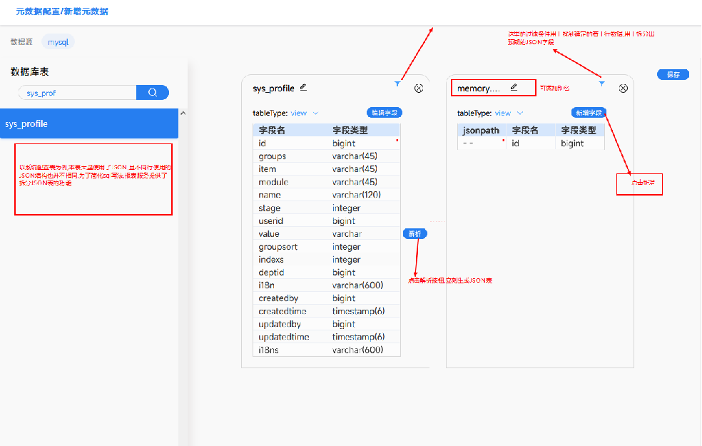
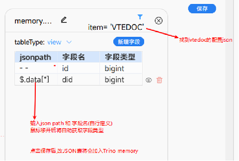
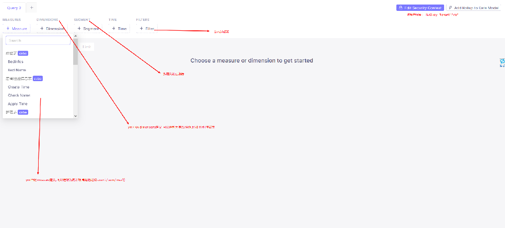
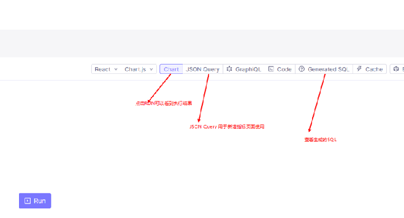
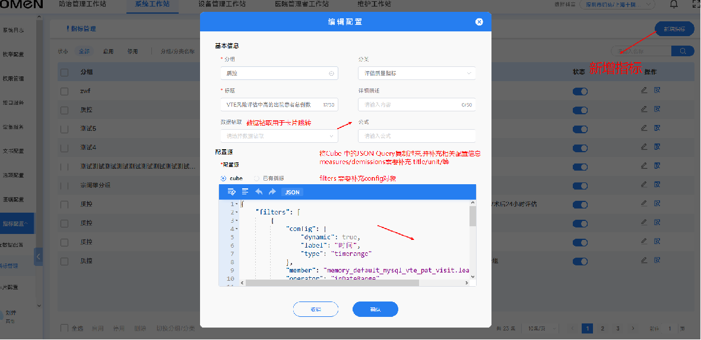
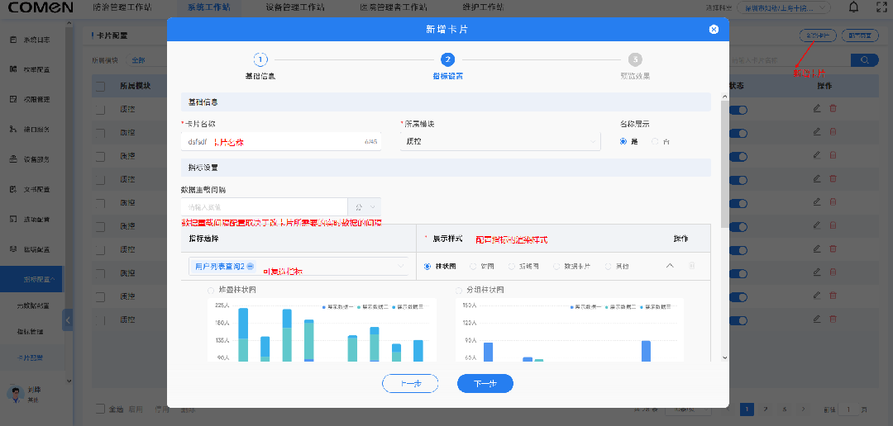
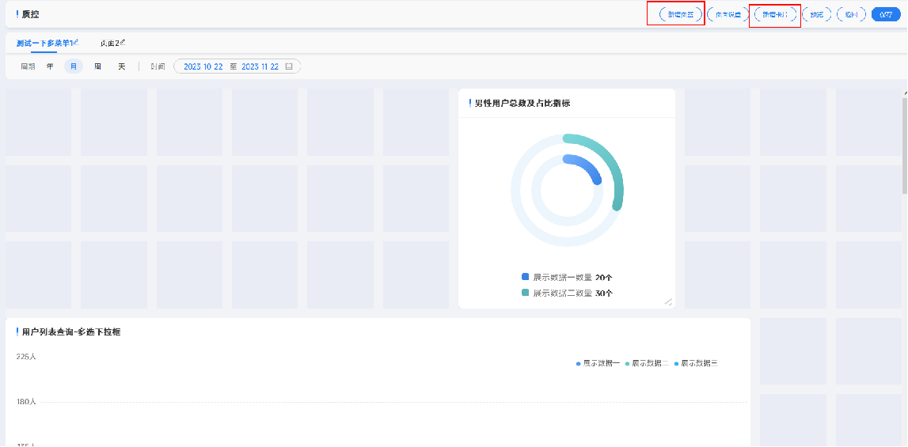

## 需求

- 自助报表能力, 开发快速构建指标, 用户可自定义指标组合形成报表
- 简化部署运维, 不引入数仓和ETL工具

## 架构图



## 计算层

提供 `Trino` 和 `DuckDB` 两种查询引擎

前者拥有更强大的内存管理和查询能力, 需要独立部署, 后者可以在不额外部署服务的情况下,引入持久化的本地计算能力

### 元数据管理

通过页面的方式配置 元数据, 配置后会生成下面的yml文件, yml存放到 resource 后进入git版本管理, 对于已被指标引用的元数据表,
一般情况下不允许修改; 可以通过重命名的方式进一步维护新的业务功能




通过 yml的方式维护,参考 dbt的实现方式

```yaml
cube:
  - name: demo_custom_view # duckdb中的表名称
    alias: 示例自定义宽表 # 表别名
    type: view # 支持 view/table
    sql: >
      SELECT * FROM range(DATE '2014-01-01', DATE '2024-12-12', INTERVAL '1 month');
  - name: uaa_user
    source: uaa_user
    alias: 用户表
    type: base_table # 基础表
    filter: 1=1
    reload: 10
  - name: demo_json_table # 自定义表名
    alias: 示例业务范围表
    type: view     # json table 仅支持视图
    filter: item = 'user_data_range' # 过滤条件
    key: value # 需要被解析的json 字段
    source: sys_profile
    columns:
      - name: userid  # 解析出来的字段名
        jsonpath: $.[*].id # json path
        type: bigint # 字段类型,如果不填,默认为 varchar
      - name: deptid
        jsonpath: $.[*].deptId[*]
        type: bigint
```

元数据维护核心目的在于构建 cube所依赖的基础 '模块', 可以认为是对原始业务表的初步加工, 为了方便构建不同的指标和指标组,
另外考虑到 业务系统中大量使用了 json类型字段, 其中 json字段可以理解为一张表维护了 一对多的关系, 所以需要拆解出这些不同类型的
json表, 构建出符合三范式的数据表, 有利于指标构建和理解

范式表构建核心利用 `jsonPath`和 `DuckDB/Trino` 强大的json支持
[代码](https://github.com/zongkx/json-table-parse)

### 数据重加载

duckdb物理表/trino内存表,都需要根据元数据yml中定义的表,来定时或实时加载源数据, 用于指标输出

#### CDC

对mysql而言,使用cdc通常是效率更高的选择
`DebeziumEngine`

```java

public void handleEvent(SourceRecord sourceRecord) {
    Struct sourceRecordValue = (Struct) sourceRecord.value();
    if (sourceRecordValue != null) {
        CDCOperation operation;
        DbtTable dbtTable = null;
        try {
            String s = (String) sourceRecordValue.get(OPERATION);
            operation = CDCOperation.forCode(s);
            if (operation != null && operation != CDCOperation.READ) {
                if (operation == CDCOperation.DELETE) {
                    Struct before = (Struct) sourceRecordValue.get(BEFORE);
                    dbtTable = tableName(before.schema().name());
                    Long id = before.getInt64("id");
                    dbtMetaData.execute(String.format("delete from %s where id =%s", dbtTable.getFullName(), id));
                } else {
                    Struct after = (Struct) sourceRecordValue.get(AFTER);
                    Long id = after.getInt64("id");
                    dbtTable = tableName(after.schema().name());
                    if (operation == CDCOperation.UPDATE) {
                        dbtMetaData.execute(String.format("delete from %s where id =%s", dbtTable.getFullName(), id));
                        dbtMetaData.execute(String.format("insert into %s select * from %s where id = %s and %s",
                                dbtTable.getFullName(), dbtTable.getFullSource(), id, dbtTable.getFilter()));
                    }
                    if (operation == CDCOperation.CREATE) {
                        dbtMetaData.execute(String.format("insert into %s select * from %s where id = %s and %s",
                                dbtTable.getFullName(), dbtTable.getFullSource(), id, dbtTable.getFilter()));
                    }
                    dbtTable.setLoad(LocalDateTime.now());
                    log.info("dbt cdc data  changed: {} with operation: {}", dbtTable.getFullName(), operation.name());
                }
            }
        } catch (Exception e) {
            if (Objects.nonNull(dbtTable)) {
                log.error("dbt cdc error {} {}", e, dbtTable.getFullName());
                super.sync(dbtTable.getFullName());// cdc执行失败后, 执行luf方式同步
            } else {
                log.error("dbt cdc error", e);
            }
        }
    }

}
```

#### 最近使用优先的同步策略(LUF)

最常被使用的指标,优先执行更新, 可以初始化一个待更新队列配合时间轮完成同步功能

```java
private static final ArrayBlockingQueue<String> syncQueue = new ArrayBlockingQueue(100);
private final DbtMetaData dbtMetaData;
private final TaskScheduler taskScheduler = new ConcurrentTaskScheduler();

public void execute() {
    log.info("dbt sync mode wheel timer init success");
//初始化时间轮
    HashedWheelTimer timer = new HashedWheelTimer(5, TimeUnit.SECONDS);
    ScheduledTaskRegistrar taskRegistrar = new ScheduledTaskRegistrar();
    taskRegistrar.setTaskScheduler(taskScheduler);
    Runnable task = () -> {
        ArrayBlockingQueue<String> syncQueue = getSyncQueue();
        Object poll = syncQueue.poll();
        if (Objects.nonNull(poll)) {
            timer.newTimeout(timeout -> sync(poll.toString()), 0, TimeUnit.SECONDS);// sync执行数据重加载的逻辑
        }
    };
    taskRegistrar.addTriggerTask(task, new PeriodicTrigger(5 * 1000));
    taskRegistrar.afterPropertiesSet();
}
```

#### 强制刷新/重建

用户指定刷新指标

## 语义层

计算层准备完成之后, 语义层的内容 核心利用 `cubejs` 自主生成指标sql 的功能



利用`cubejs`的dashboard 对配置的指标进行验证, 验证通过后,
把cube 生成的 json复制到界面中, 在后端调用cube的服务生成每个指标对应的 sql,
其中指标表完整存储了 cube生成的sql 占位符和入参, 如此可以避免在生产环境部署 cubejs服务,
仅在开发环境部署, 开发或项目人员可以在 开发阶段自助实现报表指标的构建, 构建完成后导出指标即可


## 应用层

如何实现类似自助的能力, 单一指标很容易被构建出来, 但是对于大部分定制化需求而言, 核心在于单一指标的组合,
应用层需要提供给,用户一个组合指标的页面, 以此实现自助报表的能力



### 指标和指标组 以及钻取和被钻取

通常情况下, 一个报表界面中包含了不止一个点击事件,比如从柱状图点击后跳转到此柱状图所对应的具体数据的分页列表中,
我们可以把分页列表也作为一个 单一指标进行理解, 当然这个指标可能并没有传统意义上的分组聚合, 但是它仍然可以被我们的单一指标的概念所包含,

给每个指标设计一个钻取字段,改字段引用了其它单一指标或指标组, 指标组组合出来的每个指标都有各自的钻取指标,
即可实现统一的前端逻辑,快速构建出业务所需要的功能页面