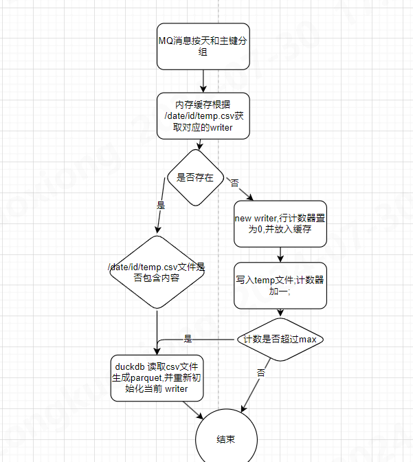

## code

[https://github.com/zongkx/csv-parquet-demo](https://github.com/zongkx/csv-parquet-demo)

## 需求

- 每秒大量的mq设备数据需要入库,单条数据20KB
- 存储空间优化
- 近实时查询,简单查询(绘制波形,回显参数,统计相对较少)
- 轻量级 embedded服务

## 原方案

Cassandra: 强大的写入能力,cql满足基本的查询
缺点: 硬件资源消耗;编码中包含大量的多线程查询逻辑;写入补偿等

## 理想方案

如果不考虑embedded服务,hadoop体系是非常适合此需求的, 比如 flink/spark mq->hudi/iceberg等,
比如hudi提供的 `copy on write`/`merge on read`表提供了方便写入策略,另外也满足对查询性能的需求,
同时可直接使用sql完成查询需要

[copy on write/merge on read](https://wenku.baidu.com/view/7575f4e56c1aff00bed5b9f3f90f76c661374cf4.html?_wkts_=1721615274732&bdQuery=Copy+On+Write%E8%A1%A8)

[Apache Hudi vs Delta Lake vs Apache Iceberg](https://www.onehouse.ai/blog/apache-hudi-vs-delta-lake-vs-apache-iceberg-lakehouse-feature-comparison)

## DuckDB

需求要求embedded服务,直接考虑使用duckdb作为查询引擎,duckdb对 csv/json/parquet等查询都提供了完整的支持,通过sql可以简化代码的同时保证查询性能

## 方案一: csv写入/duckdb查询

- 优点: 支持append写入,文件数量简单可控
- 缺点: 查询劣势(速度较慢),存储劣势(没有压缩)

## 方案二: parquet写入/duckdb查询

- 优点: 存储压缩可选,查询性能好,代码简单  [Apache-Parquet.md](..%2Fdb%2FApache-Parquet.md),
- 缺点: 不支持append写入, 需要合并策略解决海量小文件的问题,合并过程严重依赖锁,导致代码复杂度提升

## 方案三(采用此方案): csv循环写入(parquet归并)/duckdb查询

该方案采取 行列混合存储,通过csv文件作为缓冲区,避免了每秒数据落盘导致过多小文件的问题;
buffer flush的特性,解决异常断电导致的单行数据破损的问题;
按天/主键分区,查询性能不会随数据总量提示而降低

- 优点: 支持append写入,查询性能号,补偿(异常断电)代码简洁
- 缺点: 查询需要合并parquet和csv文件结果

## 实现细节

## 优化
-  避免同时执行 parquet 压缩导致CPU过高的异常
    1. 给每个 writer设置 3000-4000以内随机的阈值,可以有效避免设备同时上线导致的集中执行压缩的问题 
    2. 取消初始化writer时的压缩, 若csv文件已存在,则进行追加写即可
## 查询优化

按天分区文件,可以开启多线程查询,每个线程查询某天文件中的数据,最后再合并结果

 
 

