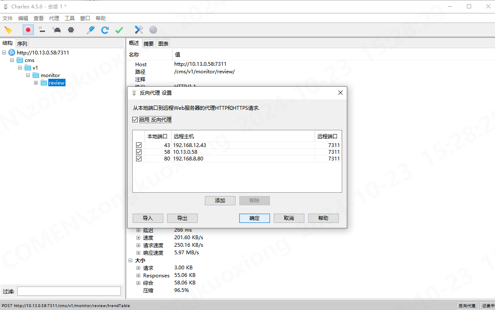

## charles

抓包工具

### windows代理

默认使用windows代理,可以直接抓取本机的http请求

### 反向代理

## stockfish

cpu benchmark

`docker run -P --name stockfish --restart=always -d andrijdavid/stockfish`

进入`bin/bash`

1. `stockfish`
2. `benchmark` 或者 `go depth 20`

## dd

`docker run --rm -v /path/to/test/dir:/testdir ubuntu:latest bash -c "dd if=/dev/zero of=/testdir/testfile bs=1M count=1024 conv=fdatasync"`

## network

`docker run --rm -it nicolaka/netshoot mtr -rw 192.168.8.80`