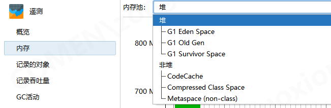

## 问题

- windows部署的springboot应用程序,任务管理器见内存缓慢增加,JProfiler 中堆和非堆内存平稳
  

## 分析

一般情况下,JVM堆外内存由`NIO`和其它第三方库使用`off-heap`内存产生
比如`apache arrow`

`JProfiler` 这种工具无法监控堆外内存, 需要添加额外的指标进行监控,
本项目使用了 `Netty`和`DuckDB`

### Netty

```java
  PooledByteBufAllocator allocator = PooledByteBufAllocator.DEFAULT;
PooledByteBufAllocatorMetric metric = allocator.metric();
```

### Duckdb

```sql
select sum(memory_usage_bytes) as total
from duckdb_memory();
```

## 监控

以上指标可以通过 `micrometer` 进行监控

```xml

<dependency>
    <groupId>io.micrometer</groupId>
    <artifactId>micrometer-core</artifactId>
</dependency>
```

```xml

<dependency>
    <groupId>io.micrometer</groupId>
    <artifactId>micrometer-registry-prometheus</artifactId>
</dependency>
```

```java

@Bean
public MeterBinder meterBinder() {
    PooledByteBufAllocator allocator = PooledByteBufAllocator.DEFAULT;
    PooledByteBufAllocatorMetric metric = allocator.metric();

    return registry -> {
        Gauge.builder("netty.used.direct.memory", metric, PooledByteBufAllocatorMetric::usedDirectMemory)
                .description("Amount of direct memory used by Netty allocator")
                .baseUnit("bytes")
                .register(registry);

        Gauge.builder("netty.used.heap.memory", metric, PooledByteBufAllocatorMetric::usedHeapMemory)
                .description("Amount of heap memory used by Netty allocator")
                .baseUnit("bytes")
                .register(registry);

        Gauge.builder("netty.num.direct.arenas", metric, PooledByteBufAllocatorMetric::numDirectArenas)
                .description("Number of direct memory arenas in Netty allocator")
                .register(registry);

        Gauge.builder("netty.num.heap.arenas", metric, PooledByteBufAllocatorMetric::numHeapArenas)
                .description("Number of heap memory arenas in Netty allocator")
                .register(registry);

        Gauge.builder("netty.small.cache.size", metric, PooledByteBufAllocatorMetric::smallCacheSize)
                .description("Size of small cache in Netty allocator")
                .register(registry);

        Gauge.builder("netty.normal.cache.size", metric, PooledByteBufAllocatorMetric::normalCacheSize)
                .description("Size of normal cache in Netty allocator")
                .register(registry);

        Gauge.builder("netty.num.thread.local.caches", metric, PooledByteBufAllocatorMetric::numThreadLocalCaches)
                .description("Number of thread local caches in Netty allocator")
                .register(registry);

        Gauge.builder("netty.chunk.size", metric, PooledByteBufAllocatorMetric::chunkSize)
                .description("Chunk size used by Netty allocator")
                .baseUnit("bytes")
                .register(registry);
    };
}
```