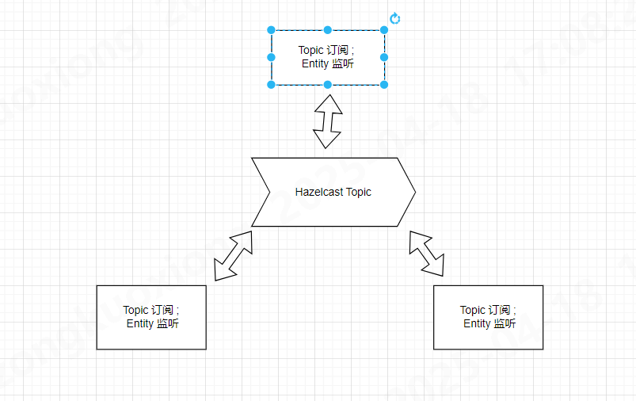

## 问题

希望通过代码来实现 duckdb的无主架构 的分布式数据库,且数据是完整复制的
目的是能够灵活部署/扩展 节点

## 主流方案

- 主节点-工作节点
  比如 `citus` `GP` `doris` 等, 使用主节点来作为协调者的身份,一般用来负责协调查询/计划生成和执行,
  工作节点作为实际的worker,负责数据存储和查询执行

- 主从-分片集群
  `MongoDB` 主节点写入,主节点写入后通过操作日志同步到从节点,从节点仅提供读操作;每个副本集包含主从节点,多个副本集扩展为分片集群,通过路由确定分片

- 无主架构
  比如`Cassandra` , Paxos 协议实现强一致性, 所有节点都是对等的,多主写入, 一般使用一致性哈希算法将数据分布在各个节点上

## 无主架构的挑战

目前 hazelcast 5.5 社区版已经移除了 CP子系统功能, 目前仅能在AP模式运行, 保证最终一致性而非强一致性,
实现强一致性需要实现基于Raft一致性算法,虽然Java目前有开源的Raft协议库,但是仍然需要一定的编程实现;

如果仅考虑保证最终一致性方案, 可以利用Hazelcast 的 发布订阅模型 和JPA entity 监听器的功能, 利用事件驱动模型来实现最终一致性

需要注意的挑战

- 一致性：这种方式实现的是最终一致性，可能存在短暂延迟，不适合需要强一致性的场景（如银行交易）。
- 冲突解决：如果多个节点同时更新同一实体，可能需要额外机制（如时间戳或版本号）来解决冲突。
- 性能：高写负载下，同步所有节点可能导致网络和处理开销增加。
- 容错性：节点故障时需确保能补上错过的更新，可能需要配置 Hazelcast Topic 的消息保留。

解决方案:

- 使用时间戳或版本号解决冲突。
- 批量更新或增量同步以提升性能。
- 配置 Hazelcast Topic 保留消息，处理节点恢复时的同步。