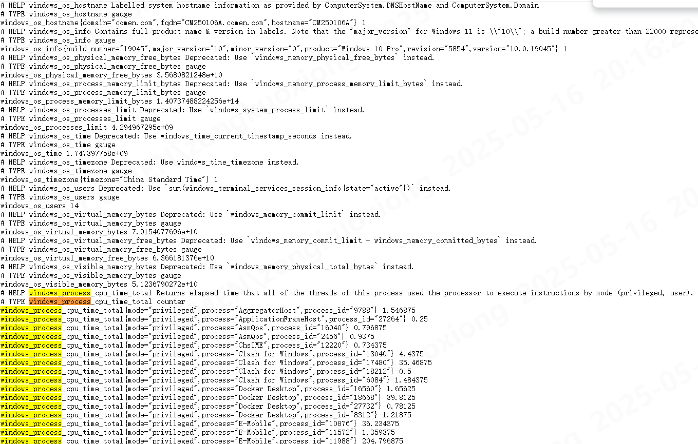

## 需求

windows指定进程监控: 包括 QT 客户端软件和 Java 进程 的内存/句柄数等指标

## windows_exporter

[windows_exporter](https://github.com/prometheus-community/windows_exporter/releases/tag/v0.30.6)

`.\windows_exporter-0.30.6-amd64.exe  --collectors.enabled=cpu,cs,logical_disk,net,os,service,system,textfile,process  --collector.process.include="(java|Ecenter|).*"`

启动后访问 [metrics](http://localhost:9182/metrics) 搜索


## prometheus/grafana

prometheus.yml

```yaml
scrape_configs:
  - job_name: 'windows'
    static_configs:
      - targets: [ '127.0.0.1:9182' ]
```

```yaml
version: '3'
services:
  prometheus:
    image: prom/prometheus
    ports:
      - "9090:9090"
    volumes:
      - ./prometheus.yml:/etc/prometheus/prometheus.yml
  grafana:
    image: grafana/grafana
    ports:
      - "3000:3000"
```

## 配置

1. 新增 `prometheus` 数据源
   Prometheus server URL : `http://127.0.0.1:9090`
2. 导入 dashboard
   [20763](https://grafana.com/grafana/dashboards/20763-windows-exporter-dashboard-2024/)
3. 新增卡片

```json
{
  "id": 15,
  "type": "timeseries",
  "title": "进程内存统计",
  "gridPos": {
    "x": 0,
    "y": 8,
    "h": 8,
    "w": 12
  },
  "fieldConfig": {
    "defaults": {
      "custom": {
        "drawStyle": "line",
        "lineInterpolation": "linear",
        "barAlignment": 0,
        "barWidthFactor": 0.6,
        "lineWidth": 2,
        "fillOpacity": 0,
        "gradientMode": "none",
        "spanNulls": false,
        "insertNulls": false,
        "showPoints": "never",
        "pointSize": 5,
        "stacking": {
          "mode": "none",
          "group": "A"
        },
        "axisPlacement": "auto",
        "axisLabel": "",
        "axisColorMode": "text",
        "axisBorderShow": false,
        "scaleDistribution": {
          "type": "linear"
        },
        "axisCenteredZero": false,
        "hideFrom": {
          "tooltip": false,
          "viz": false,
          "legend": false
        },
        "thresholdsStyle": {
          "mode": "line"
        },
        "axisWidth": -1
      },
      "color": {
        "mode": "palette-classic"
      },
      "mappings": [],
      "thresholds": {
        "mode": "absolute",
        "steps": [
          {
            "color": "green",
            "value": null
          }
        ]
      },
      "links": [],
      "min": 0,
      "unit": "bytes"
    },
    "overrides": []
  },
  "pluginVersion": "11.4.0",
  "targets": [
    {
      "application": {
        "filter": ""
      },
      "datasource": {
        "type": "prometheus",
        "uid": "dea58zs5ggkjkc"
      },
      "disableTextWrap": false,
      "editorMode": "code",
      "exemplar": false,
      "expr": "windows_process_working_set_private_bytes{job=\"$job\", instance=\"$instance\"}",
      "format": "heatmap",
      "fullMetaSearch": false,
      "functions": [],
      "group": {
        "filter": ""
      },
      "hide": false,
      "host": {
        "filter": ""
      },
      "includeNullMetadata": true,
      "instant": false,
      "interval": "",
      "intervalFactor": 1,
      "item": {
        "filter": ""
      },
      "legendFormat": "内存占用 {{process}}_{{process_id}}",
      "metric": "mysql_global_status_questions",
      "mode": 0,
      "options": {
        "showDisabledItems": false
      },
      "range": true,
      "refId": "A",
      "step": 20,
      "useBackend": false
    }
  ],
  "datasource": {
    "type": "prometheus",
    "uid": "dea58zs5ggkjkc"
  },
  "options": {
    "tooltip": {
      "mode": "multi",
      "sort": "desc"
    },
    "legend": {
      "showLegend": true,
      "displayMode": "table",
      "placement": "right",
      "calcs": [
        "lastNotNull"
      ]
    },
    "alertThreshold": true
  }
}
```