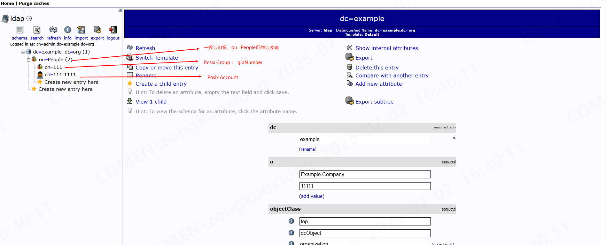

## 部署

```yaml
version: '3.8'

services:
  ldap:
    image: osixia/openldap:1.5.0
    hostname: ldap.example.org
    ports:
      - "389:389"
      # - "636:636" # 不启用 LDAPS，所以注释掉 636 端口
    environment:
      - LDAP_DOMAIN=example.org # 替换为你的域名
      - LDAP_ADMIN_PASSWORD=adminpassword # 替换为你的管理员密码
      - LDAP_BASE_DN=dc=example,dc=org # 根据你的域名生成
      - LDAP_ORGANISATION=Example Company # 组织名称
      - LDAP_TLS=false # 明确禁用 TLS
    volumes:
      - ldap_data:/var/lib/ldap # 持久化 LDAP 数据
    networks:
      - ldap-net

  phpldapadmin:
    image: osixia/phpldapadmin # 推荐使用特定版本
    hostname: phpldapadmin.example.org # 根据你的实际域名修改
    ports:
      - "8080:80" # 将 phpLDAPAdmin 暴露在 8080 端口
    environment:
      - PHPLDAPADMIN_LDAP_HOSTS=ldap # 指向 OpenLDAP 服务的主机名
      - PHPLDAPADMIN_HTTPS=false # 明确禁用 HTTPS
    depends_on:
      - ldap # 确保 ldap 服务启动后再启动 phpldapadmin
    networks:
      - ldap-net

volumes:
  ldap_data:

networks:
  ldap-net:
    driver: bridge
```

打开 8080 使用 dn: `cn=admin,dc=example,dc=org`/`adminpassword` 登录

## 概念

DN:  条目的完整路径; 一般由 CN/OU/DC 组成 ；DN 是 LDAP 目录树结构化的核心。它确保了目录中信息的清晰、有序和可寻址

## API



```xml

<dependency>
    <groupId>org.springframework.boot</groupId>
    <artifactId>spring-boot-starter-data-ldap</artifactId>
</dependency>
```

```java

@Bean
@SneakyThrows
public CommandLineRunner commandLineRunner() {
    DynamicLdapConfig ldapConfig = new DynamicLdapConfig();
    ldapConfig.setUrl("ldap://127.0.0.1:389");
    ldapConfig.setUsername("cn=admin,dc=example,dc=org");
    ldapConfig.setPassword("adminpassword");
    ldapConfig.setBaseDn("ou=People,dc=example,dc=org");
    LdapTemplate dynamicLdapTemplate = createDynamicLdapTemplate(ldapConfig);
    List<User> results = dynamicLdapTemplate.search(
            LdapQueryBuilder.query().where("objectClass").is("posixAccount"), // 寻找用户
            new LdapUserDtoContextMapper());
    System.out.println(results);
    return args -> {
    };
}

private LdapTemplate createDynamicLdapTemplate(DynamicLdapConfig config) {
    LdapContextSource contextSource = new LdapContextSource();
    contextSource.setUrl(config.getUrl());
    contextSource.setUserDn(config.getUsername());
    contextSource.setPassword(config.getPassword());
    contextSource.setBase(config.getBaseDn());
    contextSource.afterPropertiesSet();
    return new LdapTemplate(contextSource);
}

private static class LdapUserDtoContextMapper implements ContextMapper<User> {
    @Override
    public User mapFromContext(Object ctx) {
        DirContextAdapter context = (DirContextAdapter) ctx;
        User user = new User();
        user.setMember(context.getStringAttribute("uid"));
        return user;
    }
}

@Data
public class DynamicLdapConfig {
    private String url;
    private String username; // 用于绑定LDAP的DN，如 "cn=admin,dc=example,dc=com"
    private String password;
    private String baseDn;   // 用于搜索或操作的基础DN，如 "dc=example,dc=com"
}

```
