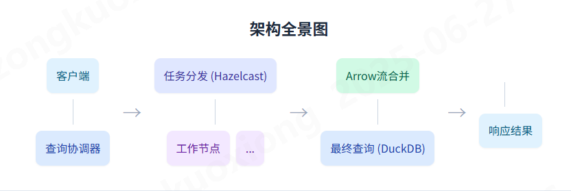

## 整体架构

- 无主架构,数据无冗余,数据仅在当前节点写入
- duckdb作为主数据源进行业务数据存储
- 设备海量数据本地存储(行列混合/分区)
- 跨节点查询

## 分布式节点设计

使用 `hazelcast`自动管理分布式节点,无主架构, embedded 服务发现

## 分布式查询设计

如何利用Apache Calcite、Hazelcast、DuckDB及Arrow等技术，将复杂的SQL查询任务分解、下推、并行执行并最终高效响应。

### **1\. SQL解析与优化**

协调器节点接收到SQL后，利用Apache Calcite进行解析和优化，生成包含计算下推和预聚合指令的分布式查询计划。

**示例：**

原始SQL：

```
SELECT name, COUNT(\*) FROM users WHERE country='JP' GROUP BY name;
```

经过Calcite优化后的逻辑计划：

```
Project(name, count)  
    Aggregate(group={name})  
        Filter(country='JP')  
            TableScan(users)
```

### **2\. 任务分发**

优化后的查询计划被分解成多个子任务，通过Hazelcast的分布式通信能力，高效地分发给集群中所有工作节点（包括自身）。

**概念示意：** 协调器向多个工作节点并行发送针对各自数据分片的查询任务。

### **3\. 局部执行与转换**

每个工作节点使用DuckDB执行分配到的局部查询任务，并将结果高效地转换为内存友好的Arrow流，为网络传输做准备。

数据缩减效果：  
局部处理的原始数据量通常远大于预聚合后输出的Arrow流数据量。例如，每个节点可能处理1000-1200单位的原始数据，但经过DuckDB的预聚合和过滤，最终输出的Arrow流数据量可能只有60-95单位，显著减少了网络传输负担。

### **4\. 收集Arrow流**

协调器节点从所有工作节点异步收集返回的Arrow流。这些流已经是经过预聚合和过滤的“瘦”数据。

**概念示意：** 各个工作节点将处理完成的局部Arrow流汇聚回协调器节点。

### **5\. 合并Arrow流**

协调器将所有接收到的Arrow流在内存中高效合并，形成一个统一的、全局的Arrow数据集，为最终查询做准备。

**概念示意：** 多个独立的Arrow流在协调器处汇聚，形成一个完整的、单一的Arrow数据集。

### **6\. 最终查询与响应**

协调器再次利用DuckDB，对合并后的全局Arrow数据集执行最终的排序、聚合和分页操作，并将最终结果返回给客户端。

数据过滤效率：  
在最终查询阶段，通常只有少量数据（例如总数据量的15%）是最终返回给客户端的，而大部分数据（例如85%）会在这一阶段被过滤掉，这进一步体现了整个流程的效率。

## **核心技术栈**

该架构的实现依赖于一系列业界领先的开源技术：

* **Apache Calcite：** 动态数据管理框架，负责SQL解析、验证和优化，生成高效的查询计划。
* **Hazelcast：** 内存计算平台，用于任务分发和节点间的快速通信。
* **DuckDB：** 高性能的嵌入式分析数据库，负责局部数据的高速查询和对Arrow流的最终处理。
* **Apache Arrow：** 跨语言的列式内存数据格式，确保了节点间数据传输和处理的极致效率。

## **架构优势**

* **高性能：** 通过计算下推和预聚合，极大减少了网络传输的数据量。Arrow格式避免了不必要的序列化/反序列化开销。
* **可扩展性：** 无主节点架构和分布式设计，使得系统可以通过简单增加工作节点来水平扩展，应对日益增长的数据量。
* **灵活性：** 模块化的技术选型，可以连接多种异构数据源，并轻松替换或升级其中任何一个组件。