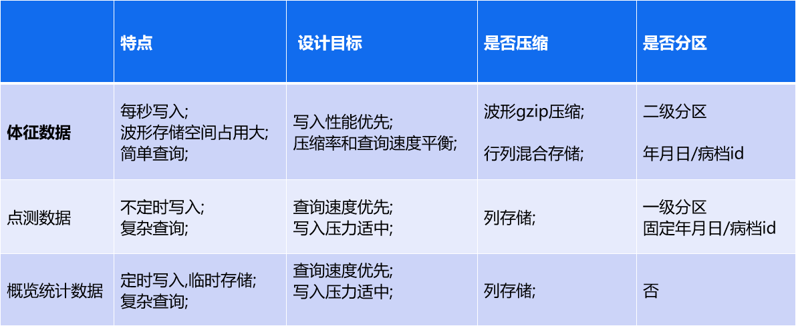
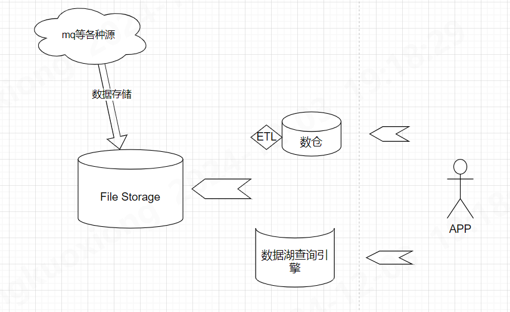
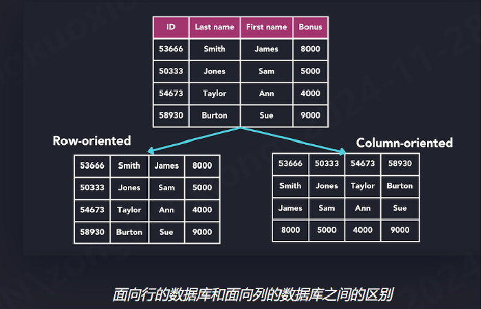
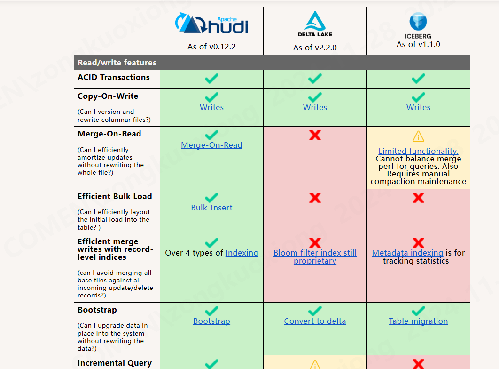
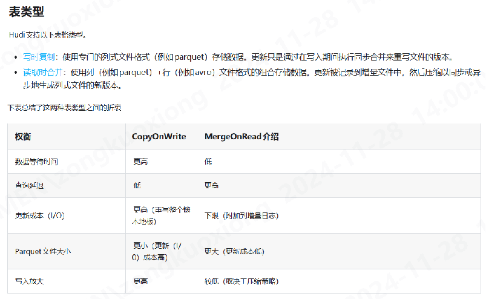

## 设备数据概述




## 列式存储

优点:

- 同列数据相似性,更好的压缩率;
- 按列查询,减少磁盘I/O
- 单列的统计/聚合性能强

缺点:

- 插入/更新/删除操作,无法追加写入

主流的列式文件存储格式:
.parquet/.orc/.arrow

(采用parquet,duckdb对parquet更加友好)



## 解决思路-分区

- 设备体征数据
  从用途上来看,都是围绕病档和时间进行的,具有良好的分区背景,因此针对体征数据设计了二级分区的目录结构
- 点测数据
  第一版方案是和体征保持一致, 后由于 查询需求, 变更为 仅根据pid 分区,所有点测数据都存储在 病档接收日期/pid/item.duckdb 中
- 概览统计数据
  概览数据进存储最近24小时数据,数据量及体积有限,故不考虑分区,直接存储在 data/AvroEcgStatistics/ecg.duckdb 中

## 列存储

- 最初的设计方案
  每秒数据直接在对应的目录中生成单秒的parquet文件  ( s_时间戳.parquet)
  写入代码中内置计数器,到达一定量的时候进行一次 合并 (多个 s_时间戳.parquet 合并成一个 m_时间戳.parquet),合并后删除
- 致命缺点
  查询和写入需要加锁,否则存在 parquet文件占用的问题, 编码难度急速上升
  读写锁带来的查询性能瓶颈

duckdb sql:

```sql
copy
(
select *
from '/data/2024-01-01/1/s_*.parquet')
    to '/data/2024-01-01/1/m_123456.parquet' (format parquet, compression lz4_raw)

```

## 开源方案

目前主流的数据湖存储方案中, 都提到了 Copy-On-Write 和 Merge-On-Read 的策略, 理解这两种策略
帮助我们如何平衡查询和写入效率, 参考下图 Apache Hudi 对这两种表策略的介绍





## 写合并 读复制

- 写合并
  使用jsonline格式, 利用 BufferWriter 写入到 temp.csv中 (
  缓冲区flush写入,配合jsonline格式天然避免异常断电导致数据破损的异常)
  行数到达一定数量后,同步生成parquet文件并清空 temp.csv ,计数还原, 循环

- 读复制
  写线程持续占用 temp.csv, 所以查询的时候需要 复制此文件 合并 *.parquet作为数据源
  截止到目前duckdb 最新版本 1.3.0 已经支持只读模式查询 csv文件， 读不再需要复制

duck sql
`select * from (select args,wave,tms from '.../123.csv' union all select args,wave,tms from '..../*.parquet) t`

## 行列混合存储

- 解决了什么问题
  在充分满足写入性能的前提下,满足体征数据简单查询的需求;
  通过 波形压缩及列式存储(lz4_raw) 满足数据文件占用优化的目标

- 未来潜在的优化空间
  分区粒度进一步缩小;
  分布式存储查询;
  设备数据时序性强,参考时序库TimescaleDB/QuestDB等通过自建时间戳索引提高查询性能的

## DuckDB

- 为什么用duckdb
    - parquet 读写良好的支持;
    - embedded服务, 替换Apache Cassandra ,无运维工作;
    - 类pg语法, 上手难度低;(可参考 ezl项目中 有关duckdb jpa方言和flyway duckdb扩展内容)
    - 列式引擎, 查询性能强;
    - 社区活跃,版本迭代迅速;
    - 报表模块有过使用经验;
    - 轻量, 对比数据湖方案严重依赖hadoop体系;

- Duckdb都用到了哪些

```sql
 -- mysql插件
PRAGMA
extension_directory  = "C:\comen" ;
FORCE
install mysql;
LOAD
mysql;
ATTACH
'host=192.168.8.80 password=Comen_2020 user=root port=23306 database=cms' AS t (TYPE mysql);

-- CTE
WITH min_tms AS (SELECT temp.input_tms, MIN(t.tms) AS min_tms
                 FROM (VALUES (1)) AS temp(input_tms)
                          JOIN t ON t.tms > temp.input_tms
                 GROUP BY temp.input_tms)
SELECT t.*
FROM t
         JOIN min_tms ON t.tms = min_tms.min_tms
WHERE t.tms > min_tms.input_tms;


-- parquet
from 'a.parquet'
copy  (select * from '/data/2024-01-01/1/s_*.parquet')  to '/data/2024-01-01/1/m_123456.parquet'  (format parquet, compression lz4_raw)

```