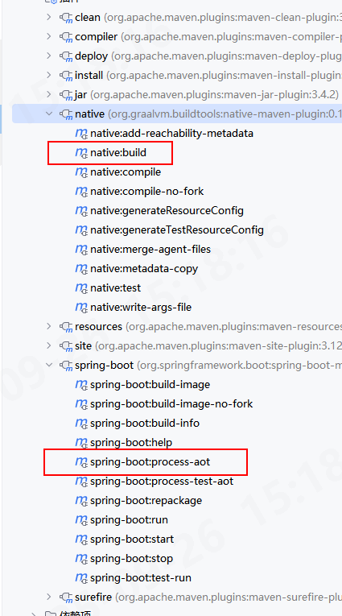

## Native Image

在运行时通过 反射（reflection） 动态访问的类和方法，都必须在构建时通过 "hints"（提示） 明确告知编译器，否则就会在运行时出错。

## plugin

```xml

<plugins>
    <plugin>
        <groupId>org.graalvm.buildtools</groupId>
        <artifactId>native-maven-plugin</artifactId>
    </plugin>
    <plugin>
        <groupId>org.springframework.boot</groupId>
        <artifactId>spring-boot-maven-plugin</artifactId>
    </plugin>
</plugins>
```

执行:

`springboot-aot` 和 `native:build` 即可


## msvc

windows 环境需要安装 c++


### jasypt

[config](https://github.com/ulisesbocchio/jasypt-spring-boot/issues/246#issuecomment-1751957932)

### duckdb

duckdb_jdbc 目前不支持 native image, DuckDB 的 Java 代码通过 JNI 与 C++ 交互时会使用**反射（Reflection）**机制。
GraalVM 需要JNI 配置元数据（JSON 文件）来知道哪些 C++ 函数和 Java 方法之间存在 JNI 调用。
由于 DuckDB 驱动程序尚未完全集成这些必要的 GraalVM 配置，因此在编译时，GraalVM 无法创建正确的连接代码，导致运行时出现致命错误。