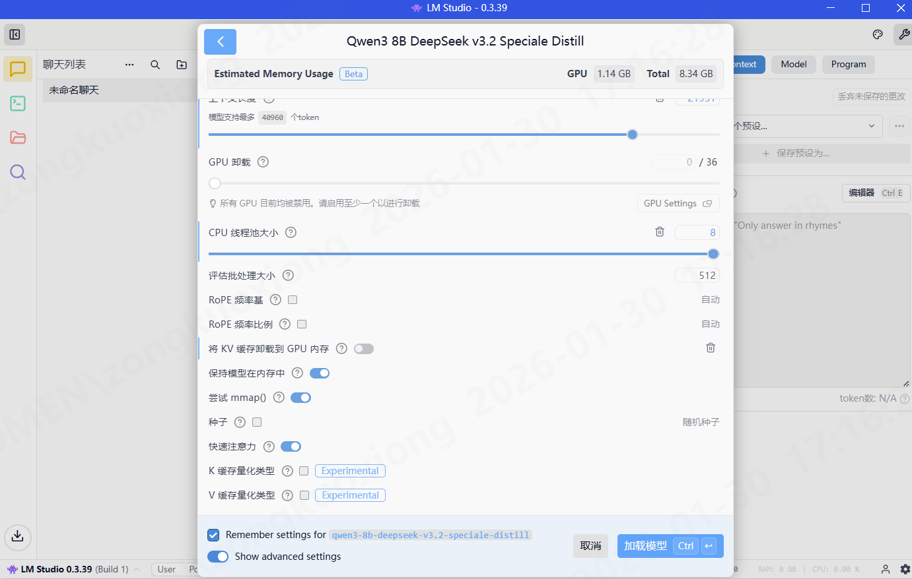
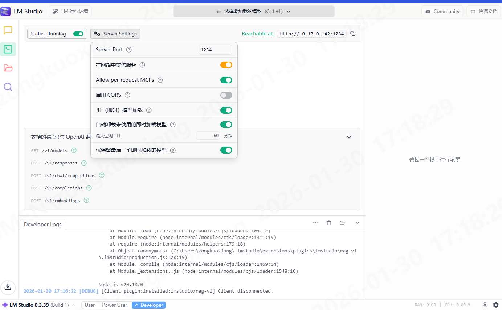

## 部署

使用 `https://lmstudio.ai/download` 非常易于部署

拿没有显卡的Windows物理机为例, 跑 `wen3-8b-deepseek-v3.2-speciale-distill`



- GPU卸载关闭
- 线程池拉满
- KV缓存到GPU关闭



开启网络服务


## MR CodeReview

在gitlab ci中添加以下配置

    - gitlab runner 需要 python环境
    - temperature设置为0.1 避免过多废话

```yaml
stages:
  - review

variables:
  GIT_DEPTH: "0"  # 关键修复：设置为 0 禁用 depth 限制
  LM_STUDIO_URL: "http://10.4.46.232:1234/v1"
  REVIEW_MODEL: "qwen3-8b-deepseek-v3.2-speciale-distill"
  # 请确保在 GitLab UI 的 CI/CD Variables 中配置了 GITLAB_TOKEN
ai_code_review:
  stage: review
  only:
    - merge_requests
  script:
    - |
      echo "--- 环境检测 ---"
      # 确保我们有远程分支的信息
      git fetch origin $CI_MERGE_REQUEST_TARGET_BRANCH_NAME
      
      echo "正在提取代码差异 (Diff)..."
      RAW_DIFF=$(git diff FETCH_HEAD...HEAD)
      
      echo "正在处理 JSON 转义 (使用 Python)..."
      SAFE_DIFF=$(echo "$RAW_DIFF" | python -c 'import json, sys; print(json.dumps(sys.stdin.read()))')

      echo "正在调用 AI 模型 $REVIEW_MODEL..."
      AI_RESPONSE=$(curl -s $LM_STUDIO_URL/chat/completions \
        -H "Content-Type: application/json" \
        -d "{
          \"model\": \"$REVIEW_MODEL\",
          \"temperature\": \"0.1\",
          \"top\": \"0.7\",
          \"messages\": [
            {\"role\": \"system\", \"content\": \"你是一个资深的 Java 开发专家。请严格评审以下 Diff：1. 仅指出可能导致崩溃的 Bug 或严重的性能问题；2. 提供具体的重构建议；3. 忽略格式等琐碎问题。要求：分条列出，言简意赅，严禁废话，总数不超 100 字，必须使用中文和Markdown语法进行排版。\"},
            {\"role\": \"user\", \"content\": $SAFE_DIFF}
          ]
        }")
      echo "正在解析 AI 回复: $AI_RESPONSE"
      export AI_RESPONSE
      REVIEW_BODY=$(echo "$AI_RESPONSE" |PYTHONIOENCODING=utf-8 python -c "import json, sys, re; data=json.load(sys.stdin); content=data['choices'][0]['message']['content']; content=re.sub(r'<think>.*?</think>', '', content, flags=re.DOTALL).strip(); print(content)")
      echo "正在解析 AI 回复: $REVIEW_BODY"
      export REVIEW_BODY
      SAFE_PAYLOAD=$(python -c "import json, os; print(json.dumps({'body': os.environ.get('REVIEW_BODY', '').strip()}))")
      curl --request POST \
        --header "PRIVATE-TOKEN: $GITLAB_TOKEN" \
        --header "Content-Type: application/json" \
          --data "$SAFE_PAYLOAD" \
          "$CI_API_V4_URL/projects/$CI_PROJECT_ID/merge_requests/$CI_MERGE_REQUEST_IID/notes"


```

另外需要 配置 Gitlab token

1. 项目设置-访问令牌,新建一个 拥有Api权限的token, 复制token
2. 项目设置-CICD-变量,新建一个变量 `GITLAB_TOKEN`,值为复制的token, 关闭 保护变量和隐藏变量

ci开启后,提交的MR就会见到AI 评论.


