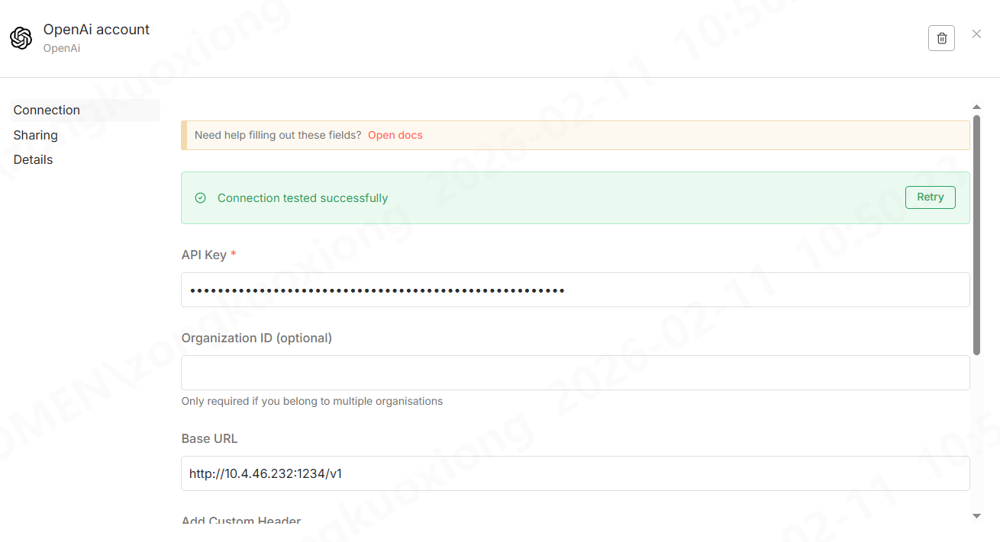
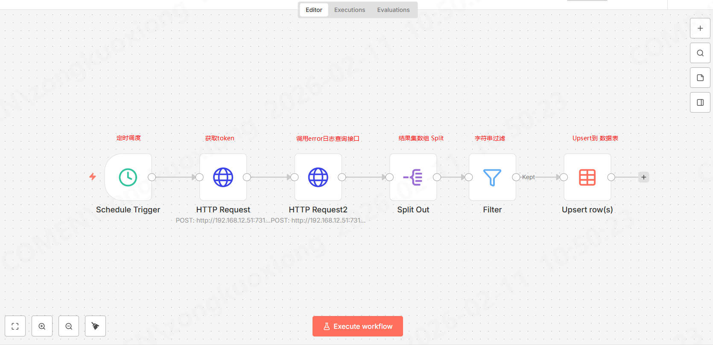
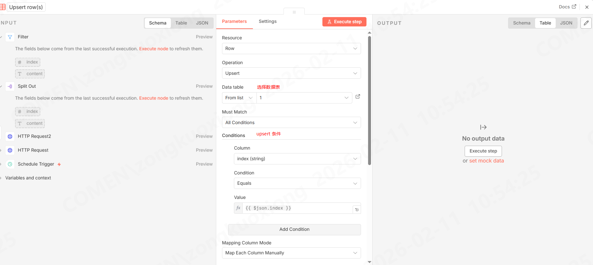

## 部署
 
```yaml
version: "3.6"
services:
  n8n:
    # 默认使用sqlite 作为数据库
    image: n8nio/n8n:latest
    restart: always
    user: root  # 添加这一行 用于解决文件权限问题
    ports:
      - "4002:5678"
    environment:
      - GENERIC_TIMEZONE=Asia/Shanghai
      - TZ=Asia/Shanghai
      - N8N_SECURE_COOKIE=false #关闭安全 Cookie 策略
    volumes:
      - /home/n8n:/home/node/.n8n
```

## credentials

举例, 配置一个 LM Studio部署的 api




## workflow

###  日志采集并进行AI分析






保存后 右上角点击Publish即可