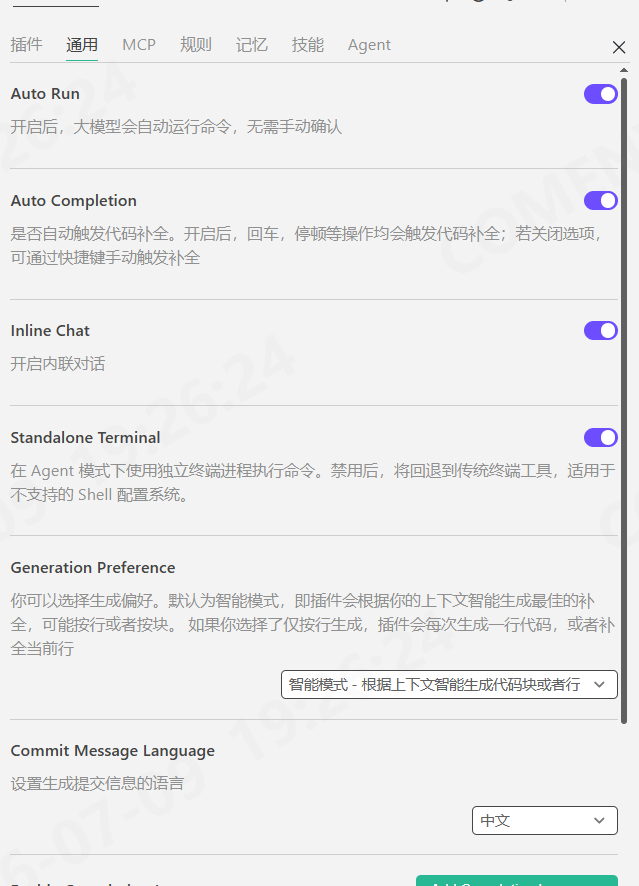
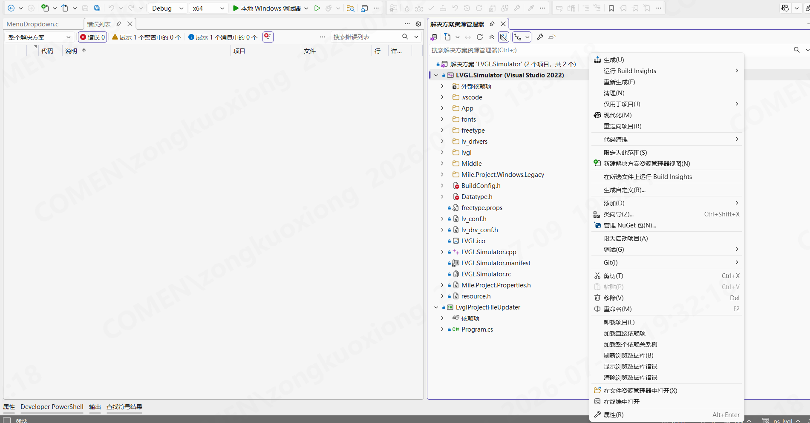
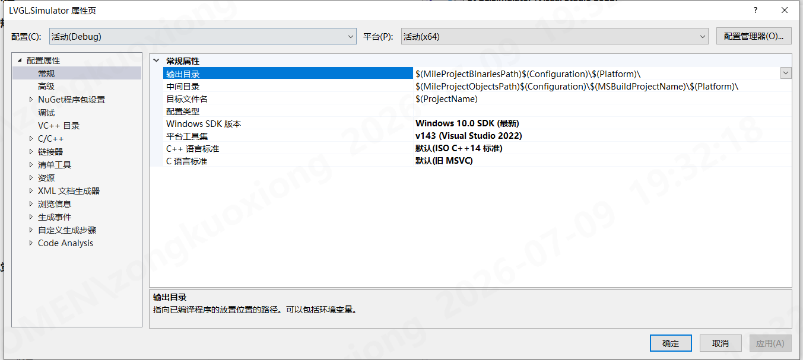

## 初始化 

最近公司开始推广使用AI, AI在公司层面推进显然需要一个验证性质的小组.

作为Java开发,我直接被拉到AI小组完成去完成一个全AI开发的嵌入式LVGL项目

当然还是比较有挑战的,我需要记录一下整个过程

## CodeBuddy

公司和腾讯合作使用 CodeBuddy作为代码开发, WorkBuddy则提供给测试使用

从安全角度出发, 我们使用了定制的域名/定制的插件, 我认为这是个相对可控的思路, 
对比我所得知的朋友公司灵活报销的手段, 企业级合作显然更注重安全和审计,
灵活报销则能带来更大的自由,总是能用到最先进的模型和工具

前段时间听闻了中转站投毒的情况发生, 这么来看安全问题着实重要.

## Cli/VS 插件

CLI 安装 CodeBuddy 非常简单, npm 安装之后简单配置登录划分的账号就可以使用,
截止到现在使用而言, 目前我还没体会到Cli的优势,VS插件实际上还是挺好用的

 

## init

拿到项目仓库地址之后,首要做的就是搭建环境,不得不说,微软的VS开发体验太差劲了, 需要安装海量的组件, 为了能够编译C, 跑LVGL 模拟器,需要的环境太复杂了,
当然无非就是稍微折腾一下,实际上准备好环境之后,每次编译也好,开发调试也好,几乎不会再出现很复杂的问题了.

VS项目最终的配置就是 属性了, 所有需要配置的内容都体现在这个地方, 可以类比 .idea 里面的工程配置

