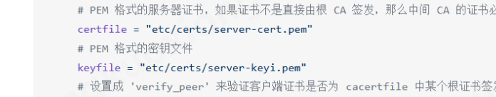
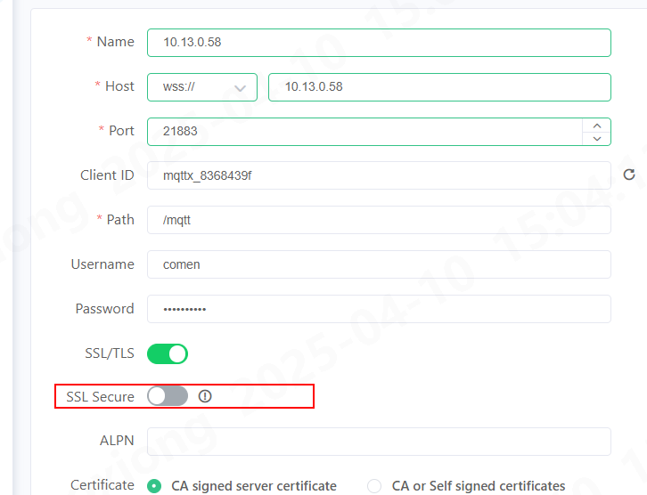

## 日志追踪

进入容器后输入

> emqx_ctl trace start client clientid log/my_client.log

即可在/opt/emqx/log中查看追踪日志

## deploy

```yaml
version: '2.2'
services:
  emqx:
    image: emqx/emqx:4.3.8
    ports:
      - 1883:1883
      - 8081:8081
      - 8083:8083
      - 8883:8883
      - 8084:8084
      - 18083:18083
    environment:
      - TZ=Asia/Shanghai

```

## EMQX的客户端上下线 webhook

1. 进入EMQX web后台 ,启用 WEB_HOOK插件
   

2. 进入左侧资源页面新增资源,选择Webhook ,并填写 URL

   > http://{ip}:{port}/emqx/webhook
   

3. 进入左侧规则页面新增两条规则(上线/下线),sql分别对应下文所写, sql配置完成之后再关联到2中添加的规则

   

   上线规则:

   > SELECT * FROM "$events/client_connected"

   下线规则:

   > SELECT * FROM "$events/client_disconnected"

## ssl 单向认证

单向认证不需要CA pem
把 key 和 cert 文件 重命名为 server-cert.perm/ server-keyi.pem



 ```
 listeners.ssl.default {
  bind = "0.0.0.0:8883"
  ssl_options {
    # PEM 格式的文件，包含一个或多个用于验证客户端证书的根 CA 证书
    # 单向认证时，该文件内容可以为空
    cacertfile = "etc/certs/rootCAs.pem"
    # PEM 格式的服务器证书，如果证书不是直接由根 CA 签发，那么中间 CA 的证书必须加在服务器证书的后面组成一个证书链
    certfile = "etc/certs/server-cert.pem"
    # PEM 格式的密钥文件
    keyfile = "etc/certs/server-keyi.pem"
    # 设置成 'verify_peer' 来验证客户端证书是否为 cacertfile 中某个根证书签发。双向认证时，必须设置成 'verify_peer'。
    # 设置成 'verify_none' 则不验证客户端证书，即单向认证。
    verify = verify_none
    # 如果设置成 true，但是客户端在握手时候没有发送证书，服务端会终止握手。双向认证时，必须设置成 true。
    # 如果设置成 false，那么服务端只有在客户端发送一个非法证书时才会终止握手
    fail_if_no_peer_cert = false
  }
}
 ```

mqttx连接 需要关闭 SSL Secure
