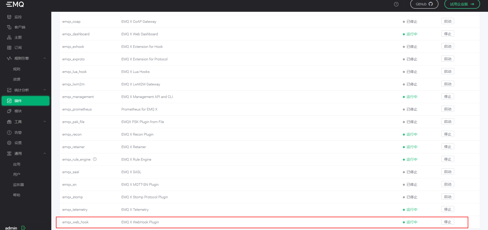

## deploy

```yaml
version: '2.2'
services:
  emqx:
    image: emqx/emqx:4.3.8
    ports:
      - 1883:1883
      - 8081:8081
      - 8083:8083
      - 8883:8883
      - 8084:8084
      - 18083:18083
    environment:
      - TZ=Asia/Shanghai

```

## EMQX的客户端上下线 webhook

1. 进入EMQX web后台 ,启用 WEB_HOOK插件
   

2. 进入左侧资源页面新增资源,选择Webhook ,并填写 URL

   > http://{ip}:{port}/emqx/webhook
   

3. 进入左侧规则页面新增两条规则(上线/下线),sql分别对应下文所写, sql配置完成之后再关联到2中添加的规则

   

   上线规则:

   > SELECT * FROM "$events/client_connected"

   下线规则:

   > SELECT * FROM "$events/client_disconnected"

 
 