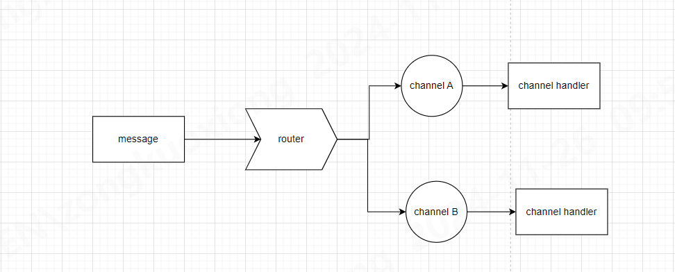

## 参考

[spring](https://docs.spring.io/spring-integration/reference/router/implementations.html)

[MQTT案例讲述及源码](https://juejin.cn/post/7276678098409979939#heading-5)

## 图



- 所有的 channel 都需要绑定一个 `MessageHandler`
- `Router` 需要绑定一个全局 `Channel`

## ClientFactory 和 Adapter

一般情况下,全局定义唯一的 `MqttPahoClientFactory`和 `MqttPahoMessageDrivenChannelAdapter` 即可,
adapter 订阅所有的 topic

```java

@Bean
public MqttPahoClientFactory mqttClientFactory() {
    DefaultMqttPahoClientFactory factory = new DefaultMqttPahoClientFactory();
    MqttConnectOptions mqttConnectOptions = new MqttConnectOptions();
    mqttConnectOptions.setCleanSession(true);
    mqttConnectOptions.setAutomaticReconnect(true);
    mqttConnectOptions.setServerURIs(new String[]{"tcp://127.0.0.1:1883"});
    factory.setConnectionOptions(mqttConnectOptions);
    return factory;
}

@Bean
public MessageProducer messageProducer(MqttPahoClientFactory mqttClientFactory,
                                       @Qualifier("inbound") MessageChannel channel) {
    MqttPahoMessageDrivenChannelAdapter adapter =
            new MqttPahoMessageDrivenChannelAdapter(UUID.randomUUID().toString(), mqttClientFactory, "A/#", "B/#");
    adapter.setCompletionTimeout(5000);
    adapter.setQos(0);
    adapter.setOutputChannel(channel);
    return adapter;
}
```

## Router

两种写法:

1. AbstractMessageRouter
   ```java
     @Bean
     @Router(inputChannel = "inbound")
     public AbstractMessageRouter abstractMessageRouter(@Qualifier("aChannel") MessageChannel aChannel, @Qualifier("bChannel") MessageChannel bChannel) {
         return new AbstractMessageRouter() {
             @Override
             private Collection<MessageChannel> determineTargetChannels(Message<?> message) {
                 MessageHeaders headers = message.getHeaders();
                 String topic = headers.get(MqttHeaders.RECEIVED_TOPIC).toString();
                 log.info("received topic :{} \t payload :{}", topic, message.getPayload());
                 if (topic.startsWith("A")) {
                     return Collections.singleton(aChannel);
                 } else {
                     return Collections.singleton(bChannel);
                 }
             }
         };
     }
    ```
2. DSL
    ```java
   @Bean  //dsl 写法等价于 上面的  AbstractMessageRouter
    public IntegrationFlow routerFlow2() {
        return IntegrationFlow.from("inbound")
                .route(Message.class, m -> m.getHeaders().get(MqttHeaders.RECEIVED_TOPIC, String.class).split("/")[0],
                        m -> m
                                .channelMapping("A", "aChannel")
                                .channelMapping("B", "bChannel"))
                .get();
    }
   ````

## MessageHandler

路由分发到不同channel后,具体再实现不同的handler

```java

@Bean(name = "aChannel")
public MessageChannel aChannel() {
    return new DirectChannel();
}

@Bean(name = "bChannel")
public MessageChannel bChannel() {
    return new DirectChannel();
}

@Bean
@ServiceActivator(inputChannel = "aChannel")
public MessageHandler aMessageHandler() {
    return message -> {
        System.out.println("aaaaaa");
    };
}

@Bean
@ServiceActivator(inputChannel = "bChannel")
public MessageHandler bMessageHandler() {
    return message -> {
        System.out.println("bbbb");
    };
}
```
