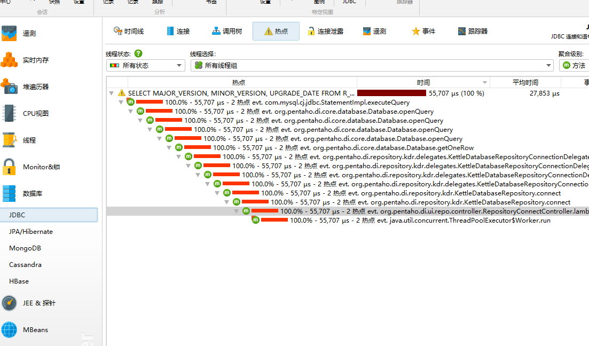
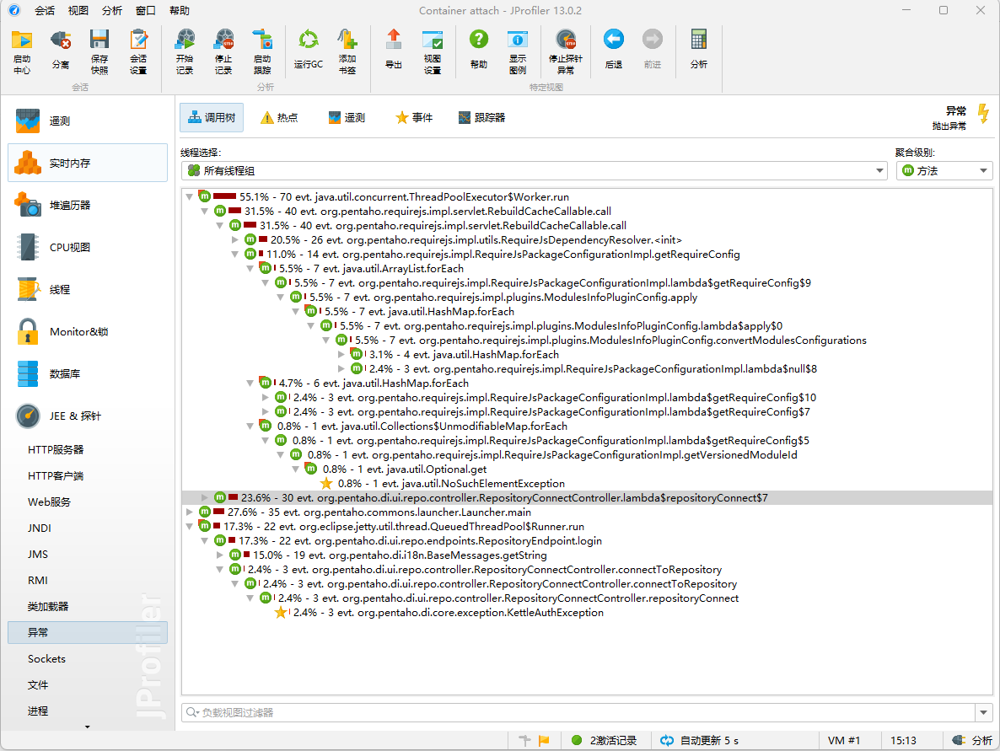
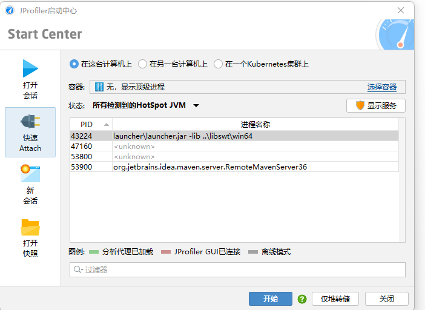

## SK

> S-NEO_PENG#890808-g4tibemn0jen#37bb9
> S-J14-NEO_PENG#890808-1jqjtz91lywcp9#23624

## 本地agent 启动

非agent启动也可以探测部分jvm数据等，建议开启agent启动
windows：添加启动参数
> -agentpath:D:\\dev\\jprofiler\\bin\\windows-x64\\jprofilerti.dll=port=8849,nowait

linux：添加启动参数
> -agentpath:/opt/jprofiler13.0.2/bin/linux-x64/libjprofilerti.so=port=8849,nowait

选择这个本地服务

