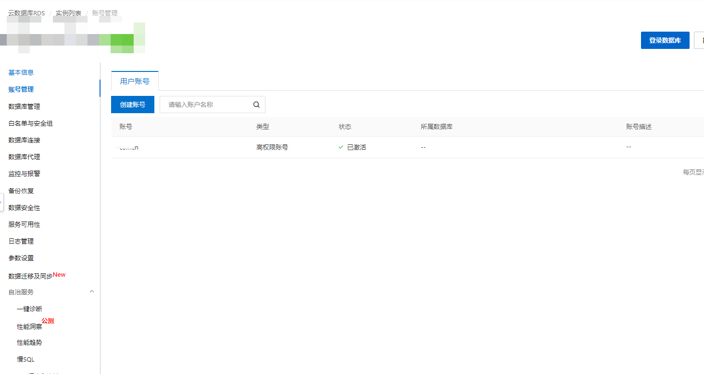
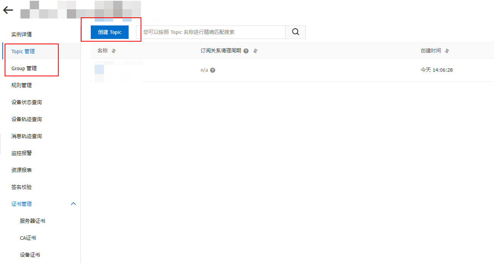
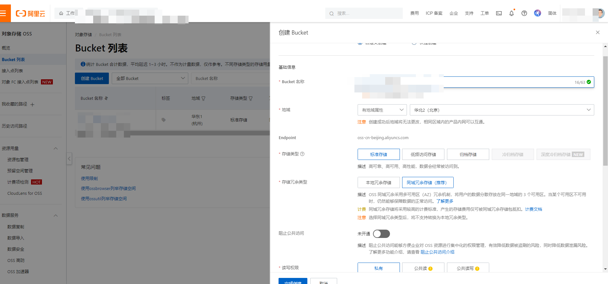

## 镜像制作

### 基础镜像

这是一个同时包含jdk17和nginx环境的基础镜像

```Dockerfile
FROM bellsoft/liberica-openjdk-debian:17-cds
RUN apt install nginx -y
```

```shell
docker build -t bellsoft/liberica-openjdk-debian-nginx:17-cds .
```

### 镜像分层构建

```Dockerfile
FROM bellsoft/liberica-openjdk-debian:17-cds as builder
WORKDIR application
ADD target/*.jar app.jar
RUN java -Djarmode=layertools -jar app.jar extract

FROM nginx:1.24.0 as builder1
ADD front/nginx/ /etc/nginx/
ADD front/html/web /usr/share/nginx/html/web
ADD front/html/app /usr/share/nginx/html/app

# 正式构建镜像
FROM bellsoft/liberica-openjdk-debian-nginx:17-cds
ENV TZ=Asia/Shanghai
WORKDIR application
EXPOSE 8080
ENV PARAMS="-Dspring.profiles.active=dev -Dlogging.level.org.hibernate.SQL=info"

# nginx
COPY --from=builder1 /etc/nginx/ /etc/nginx/
COPY --from=builder1 /usr/share/nginx/html/web /usr/share/nginx/html/web
COPY --from=builder1 /usr/share/nginx/html/app /usr/share/nginx/html/app

# jar
COPY --from=builder application/dependencies/ ./
COPY --from=builder application/spring-boot-loader/ ./
COPY --from=builder application/snapshot-dependencies/ ./
COPY --from=builder application/application/ ./


COPY /front/start.sh /start.sh
RUN chmod +x /start.sh
ENTRYPOINT ["/start.sh"]
```

```shell
#!/bin/sh
# 启动第一个进程
nginx
# 启动第二个进程
java $PARAMS org.springframework.boot.loader.JarLauncher
```

注意: nginx.conf中的第一行 `user www-data`;

## 环境准备

### rds

- 创建数据库及数据库账号
  
  

### mqtt

- 创建topic,groupid



### oss

- 创建桶
  

## k8s 配置


```yaml
      securityContext:
        sysctls:
          - name: net.core.somaxconn
            value: '1024'
```