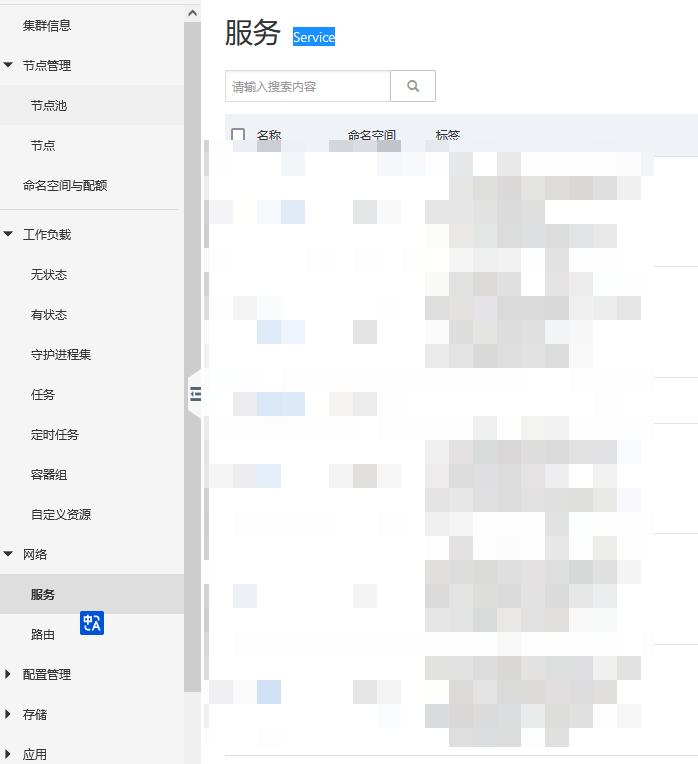
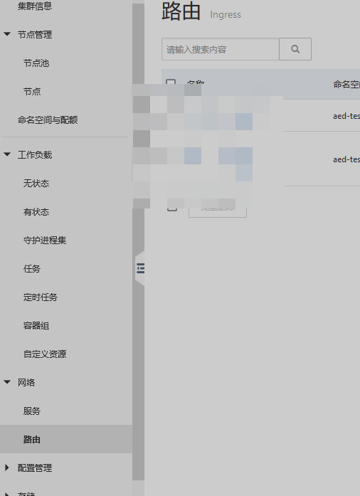
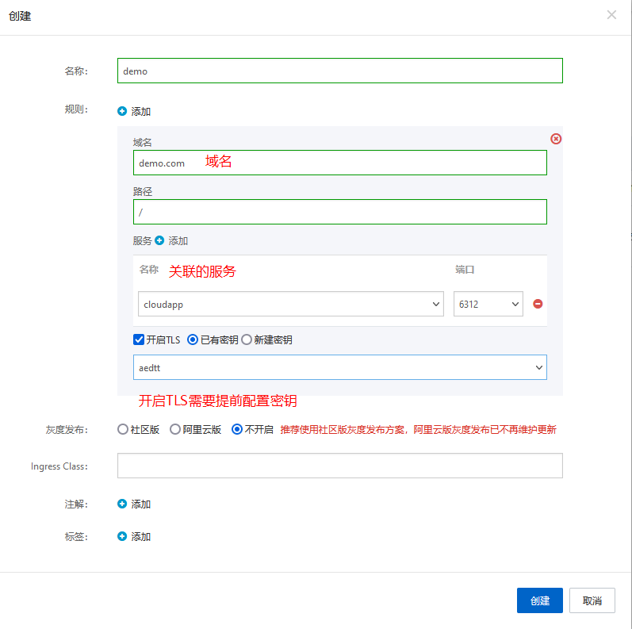

## docker images 推送

```shell
docker login --username=demo@aliyun.com registry.cn-shenzhen.aliyuncs.com
# password
docker tag {本地镜像ID或者本地镜像TAG} {阿里云镜像TAG:registry.cn-shenzhen.aliyuncs.com/demo/myapp:latest}
docker push {阿里云镜像TAG:registry.cn-shenzhen.aliyuncs.com/demo/myapp:latest}
```

## k8s部署

- Deployment-菜单
  
- Deployment-设置镜像
  
- Deployment-容器端口/变量
  
- Deployment-日志配置(关联 sls logstore)
  
- Service-菜单
  
- Service-创建(负载均衡)
  
- Service-创建(负载均衡)
  
- Ingress-菜单
  
- Ingress-创建
  

## Deployment更新

1. 安装`kubectl`
2. `{home}\.kube` 下 创建 `config`文件
3. 进入阿里云集群信息-连接信息-公网访问, 复制config内容
4. 执行命令更新pod

```shell
kubectl set image deployment/demo demo=registry-vpc.cn-shenzhen.aliyuncs.com/demo/myapp:latest -n default
```

## SSL证书

- Java使用JKS
  https://csr.chinassl.net/convert-ssl.html
  
- Nginx使用
  ```dockerfile

  FROM nginx:1.24.0
  COPY ./app/dist/ /usr/share/nginx/html/app
  ADD zkx.crt /home/zkx.crt
  ADD zkx.key /home/zkx.key
  COPY nginx/conf/nginx.conf /etc/nginx/nginx.conf
  ```

  ```
    server {
        listen   7443 ssl ;
        server_name  zkx.com;
        ssl_certificate /home/zkx_public.crt;
        ssl_certificate_key /home/zkx.key;
  
        proxy_set_header Host $host;
        proxy_set_header X-Real-IP $remote_addr;
        proxy_set_header X-Forwarded-For $proxy_add_x_forwarded_for;
        location / {
            try_files $uri $uri/ /index.html;
            root   /usr/share/nginx/html/web/; 
             index  index.html index.htm;
        }
  ```


